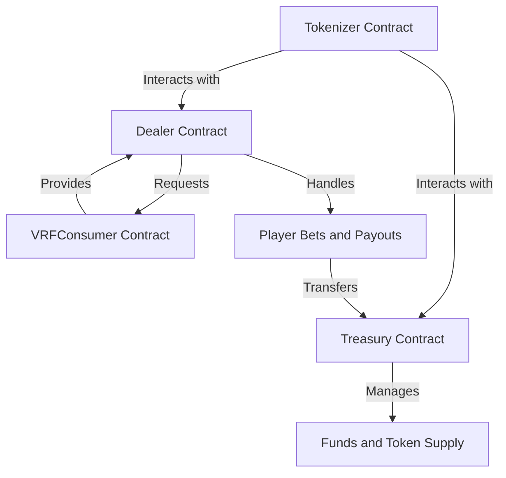

# 42FIORINO (FLOR) Token Ecosystem Whitepaper

## Executive Summary

42FIORINO introduces a decentralized gaming and treasury ecosystem built on blockchain technology. The ecosystem consists of a native ERC20 token (FLOR), a transparent blackjack gaming platform, and a secure treasury system. By leveraging smart contracts and verifiable randomness, 42FIORINO provides a fair, transparent, and secure environment for blockchain gaming while maintaining strong treasury management protocols.

## 1. Introduction

Blockchain gaming has seen significant growth but continues to face challenges related to transparency, fairness, and effective treasury management. 42FIORINO addresses these issues through a comprehensive ecosystem designed to provide fair gameplay with verifiable randomness and secure financial management through multi-signature authorization.

The 42FIORINO ecosystem consists of four main components:
- **42FIORINO (FLOR) Token**: An ERC20 token that serves as the ecosystem's currency
- **Treasury System**: A multi-signature wallet that manages token supply and ecosystem funds
- **Blackjack Platform**: A decentralized card game using verifiable randomness
- **VRF Consumer**: A randomness provider using Chainlink's Verifiable Random Function

## 2. Problem Statement

Traditional online gaming platforms face several challenges:

1. **Trust and Transparency**: Players must trust that games are not rigged and that odds are as stated
2. **Privacy and Security**: User data and financial information security concerns
3. **Payment Processing**: High fees, delayed withdrawals, and regional restrictions
4. **Centralized Control**: Platform operators have unilateral power over rules and funds

Additionally, many blockchain gaming platforms suffer from:
1. **Poor Randomness Generation**: Vulnerable or manipulable random number generation
2. **Inefficient Treasury Management**: Lack of proper governance for ecosystem funds
3. **High Transaction Costs**: Prohibitive gas fees for gameplay
4. **Limited Gameplay**: Simplified games due to blockchain constraints

## 3. Token Economics

### 3.1 42FIORINO (FLOR) Token

42FIORINO is an ERC20 token that serves as the primary medium of exchange within the ecosystem:

- **Token Standard**: ERC20
- **Token Symbol**: FLOR
- **Role-Based Access Control**: Minting, burning, and pausing capabilities controlled by specific roles
- **Supply Management**: 
	- Managed through the Treasury's multi-signature system
	- Trying your luck triggering a random event and calling handleRandomness

### 3.2 Token Utility

- **Gaming Currency**: Used for placing bets in the Blackjack platform
- **House Edge**: A small percentage (configurable, typically 2.5%) is taken as house edge
- **Treasury Management**: Earnings are managed through a secure multi-signature wallet

## 4. Technical Architecture

The 42FIORINO ecosystem is built on four primary smart contracts that work together to provide a secure, transparent, and fair gaming experience:

### 4.1 Core Contracts

1. **Tokenizer Contract**: ERC20 implementation with role-based access control
2. **Treasury Contract**: Multi-signature wallet controlling token management
3. **Dealer Contract**: Blackjack game implementation with verifiable randomness
4. **VRFConsumer Contract**: Interface with Chainlink VRF for secure randomness

### 4.2 Interaction Flow

1. Players use 42FIORINO tokens to place bets in the Dealer contract
2. The Dealer uses the VRFConsumer to request verifiable random numbers
3. Game outcomes determine token distribution between players and Treasury
4. Treasury manages the collected fees and ecosystem fund allocation through multi-signature governance

## 5. Blackjack Platform

The Dealer contract implements a complete blackjack card game with the following features:

### 5.1 Game Rules

- Standard blackjack rules with hit, stand, and double down options
- Blackjack (natural 21) pays 3:2
- Dealer must stand on 17 or higher
- Configurable house edge (default: 2.5%)

### 5.2 Fairness Mechanisms

- Chainlink VRF provides cryptographically secure randomness
- Card selection uses bitmap tracking to prevent duplicates
- All game states and outcomes are publicly verifiable on-chain

### 5.3 Betting Mechanics

- Configurable minimum and maximum bet limits
- Double down option to increase initial bet
- Automatic payout calculation based on game outcome

## 6. Treasury System

The Treasury contract implements a secure multi-signature wallet for ecosystem fund management:

### 6.1 Multi-signature Governance

- Multiple authorized signatories required for fund management
- Configurable threshold for transaction approval
- Transparent proposal and execution process

### 6.2 Fund Management

- Token minting and burning proposals
- Dynamic supply adjustments through random events that can result in minting (1-5% of supply) or burning tokens based on VRF-secured randomness
- Secure management of game proceeds

## 7. Security Features

### 7.1 Role-Based Access Control

The 42FIORINO ecosystem implements OpenZeppelin's AccessControl pattern with specific roles:
- DEFAULT_ADMIN_ROLE: Manages roles and system configuration
- MINTER_ROLE: Authorized to create new tokens
- BURNER_ROLE: Authorized to destroy tokens
- PAUSER_ROLE: Can pause token transfers in emergency situations

### 7.2 Secure Randomness

- Chainlink VRF integration for provably fair and verifiable randomness
- Request and fulfillment pattern to prevent manipulation
- Proper randomness management to ensure game integrity

### 7.3 Multi-signature Authorization

- Treasury transactions require multiple approvals
- Prevents single-point-of-failure or rogue administrator risks
- Transparent on-chain transaction proposals and executions

## 8. Roadmap

### Phase 1: Platform Launch
- Initial token distribution
- Blackjack game deployment
- Basic treasury functionality

### Phase 2: Ecosystem Expansion
- Blackjack split function
- Additional casino games (poker, roulette)
- Enhanced treasury features and governance
- Staking and yield mechanisms

### Phase 3: Cross-chain Integration
- Multi-chain support
- Liquidity pooling across blockchains
- Enhanced interoperability

## 9. Technical Appendix
### 9.1 Smart Contract Architecture

This diagram illustrates the interaction between the core smart contracts in the 42FIORINO ecosystem. The Tokenizer contract serves as the ERC20 token implementation, interacting with both the Treasury and Dealer contracts. The Treasury contract manages funds and token supply, while the Dealer contract handles player bets and payouts. The VRFConsumer contract ensures secure randomness for the Dealer contract, maintaining fairness in gameplay.

### 9.2 Contract Interactions

- **VRFConsumer**: Provides verifiable randomness to both Treasury and Dealer contracts
- **Tokenizer**: Core ERC20 token with role-based permissions, interacts with all contracts
- **Treasury**: Controls token supply through minting/burning and manages funds via multisig
- **Dealer**: Implements blackjack game mechanics and handles betting interactions

### 9.3 Security Considerations

1. **Role Separation**
   - DEFAULT_ADMIN_ROLE: System configuration only
   - MINTER_ROLE: Granted to Treasury for controlled token creation
   - BURNER_ROLE: Granted to Treasury for controlled token destruction
   - PAUSER_ROLE: Emergency functions for critical situations

2. **Randomness Security**
   - Request-response pattern prevents front-running
   - Chainlink VRF provides cryptographically verifiable randomness
   - Bitmap tracking prevents card duplication in gameplay

3. **Fund Security**
   - Treasury requires multiple signatures for any action
   - Dealer includes maximum bet limits to prevent excessive exposure
   - House edge parameters are controlled through secure governance

### 9.4 Technical Specifications

- **Blockchain**: Ethereum compatible networks (Mainnet, Polygon, BSC)
- **Language**: Solidity 0.8.6+
- **Libraries**: OpenZeppelin Contracts (Access Control, ERC20, Pausable)
- **External Dependencies**: Chainlink VRF for secure randomness
- **Testing Framework**: Hardhat, Foundry

### 9.5 Deployed Contracts

| Contract    | Network | Address                                    |
|-------------|---------|--------------------------------------------|
| Tokenizer   | Sepolia | 0x0000000000000000000000000000000000000000 |
| Treasury    | Sepolia | 0x0000000000000000000000000000000000000000 |
| Dealer      | Sepolia | 0x0000000000000000000000000000000000000000 |
| VRFConsumer | Sepolia | 0x0000000000000000000000000000000000000000 |